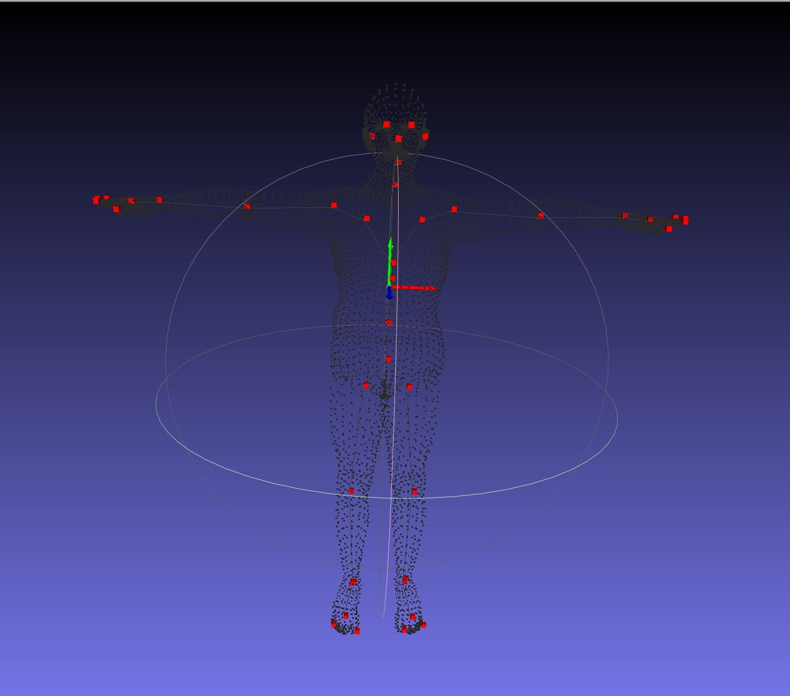

# 项目介绍

人体检测
人脸检测
人手检测
人体关键点2d、3d检测
手部关键点2d、3d检测
人脸2d、3d关键点检测
眼动追踪
人脸三维重建（model based）
数字人驱动
ARVR 等

# 视频链接
### models
每个功能当前最好的效果， 如有改进会在这里更新  
[身体检测、2d姿态估计、3d姿态估计](https://www.bilibili.com/video/BV1pZ421v7Kv/?spm_id_from=333.999.0.0&vd_source=749ec648430448c32529b54f8b808901)

### totals
所有的视频链接， 会在这里面添加  
[B站合集： 包含所有的视频](https://space.bilibili.com/479651724/channel/collectiondetail?sid=2090458)

# CSDN
[链接](https://blog.csdn.net/yunshangyue/article/details/136319546)

# 项目文件下载
链接：https://pan.baidu.com/s/1ZGqMwFr3Hw18hpOJweJ-ig?pwd=qwer 
提取码：qwer 

# 功能介绍
### models
- [x] body detection； 身体检测
- [x] body 2d keypoints estimation；body 2d pose estimation； 身体2d 关键点估计；身体2d 姿态估计
- [x] body 3d keypoints estimation；body 3d pose estimation； 身体3d 关键点估计；身体3d 姿态估计

- [ ] hand detection； 手部检测
- [ ] hand 2d keypoints estimation；hand 2d pose estimation； 手部2d 关键点估计；手部2d 姿态估计
- [ ] hand 3d keypoints estimation；hand 3d pose estimation； 手部3d 关键点估计； 手部3d 姿态估计

- [ ] head detection; 人脸检测
- [ ] face landmark 2d regression; 脸部2d关键点回归
- [ ] face landmark 3d regression; 脸部3d关键点回归
### input format
- [x] 图片
- [x] 相机
- [x] 视频

### output format
- [x] plot，可视化
- [ ] fbx

# 项目路径
    HumanAI
    |----exe
    |----config.json
    |----license.bin
    |----dlls
    |----test_video.mp4
    |----resources
    |----|----logs
    |----|----ckpts
    |----|----|----**.trts

### 路径注意事项
1. config.json 
不要更改名字和路径， 不要删除内部的key
2. ***.trts 和 license.bin
不能修改文件名字，文件路径可以随着项目指定
3. 其余路径修改可在config.json进行配置即可

# Template
下图是项目中使用的template, 在 docs_user/template 可以将所有的几何文件加载自己详细查看
  